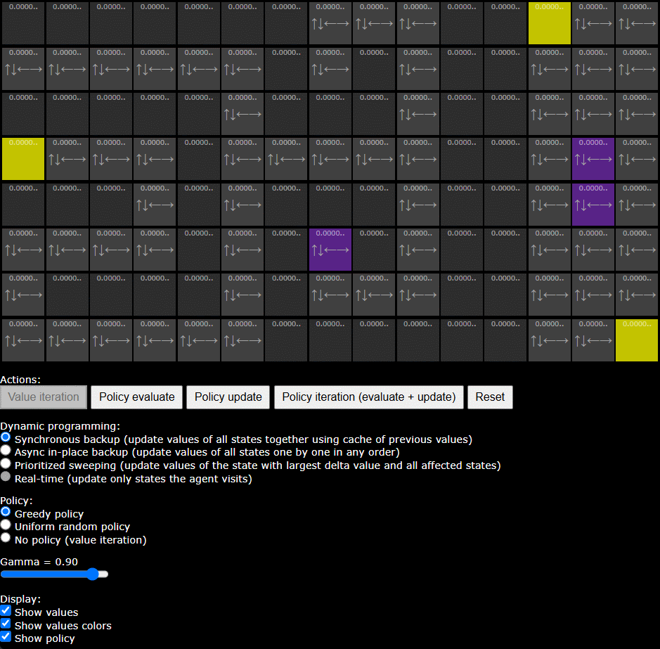

# RL Playground

Interactive maze solver with vanilla reinforcement learning




### Install
```
conda env create --name web --file=./environment.yml
consta activate web
source .env
```
### Run
```
python serve.py
```
